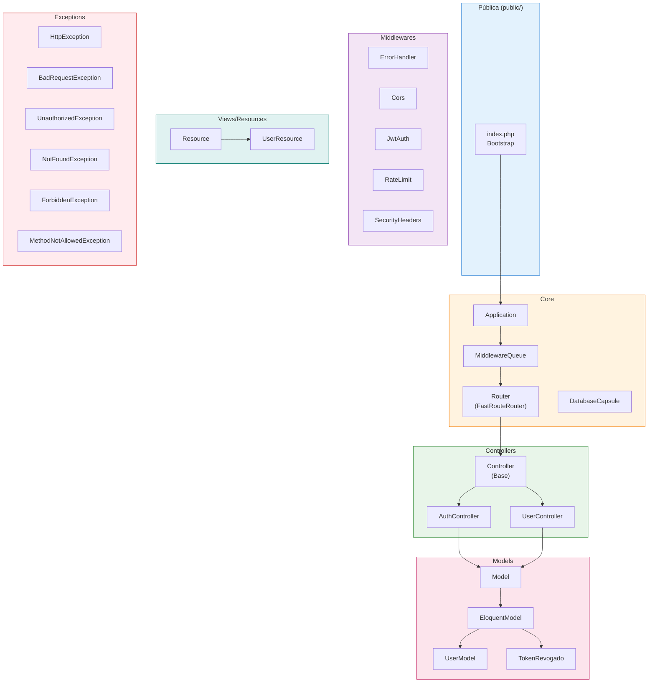
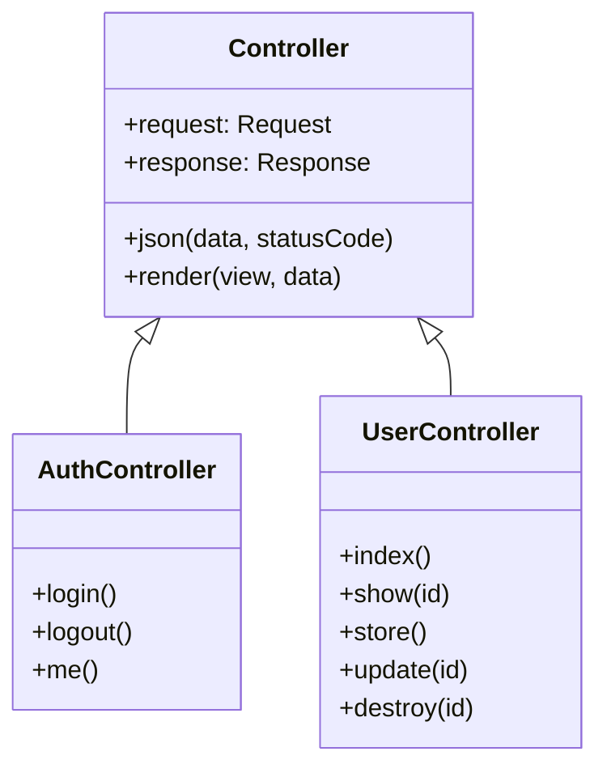
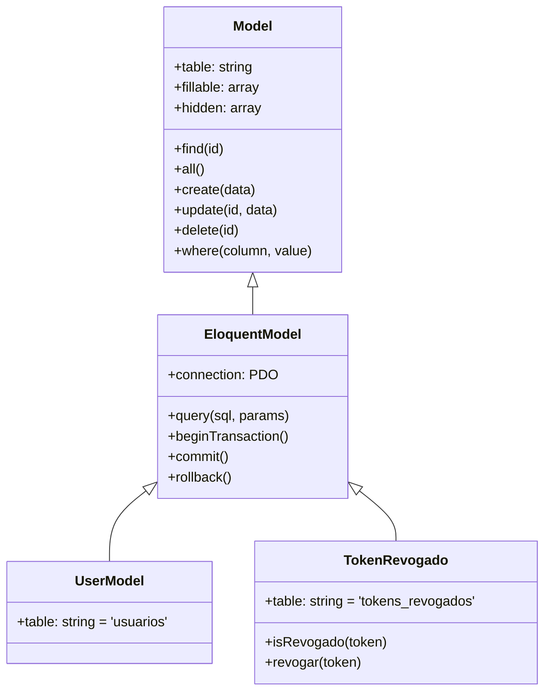
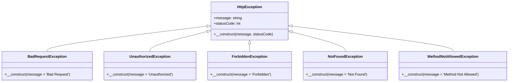
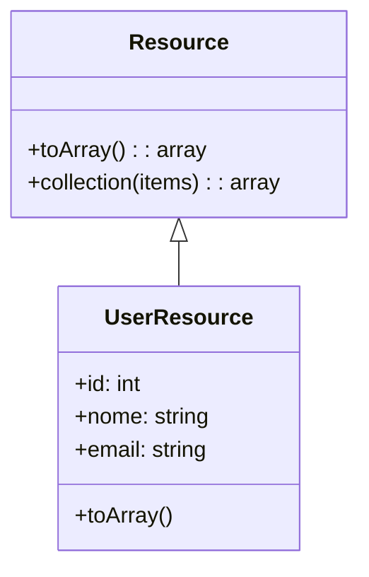

# Documentação de Arquitetura do Framework Parrot PHP

Este documento apresenta a arquitetura completa do framework Parrot PHP através de diagramas visuais que facilitam o entendimento da estrutura e fluxo do sistema.

---

## 1. Diagrama de Arquitetura Geral

O diagrama abaixo apresenta a visão geral dos principais componentes do framework Parrot PHP, desde o ponto de entrada até a camada de visualização.

---

## 2. Diagrama de Fluxo de Requisição (Request Lifecycle)

Este diagrama ilustra o ciclo de vida de uma requisição HTTP no framework, demonstrando o padrão Onion/Pipeline de middlewares.

```mermaid
flowchart LR
    subgraph CLIENT["Cliente"]
        HTTP["Requisição HTTP"]
    end

    subgraph ENTRADA["Ponto de Entrada"]
        BOOT["public/index.php<br/>Bootstrap"]
    end

    subgraph PIPELINE["Pipeline de Middlewares"]
        direction TB
        M1["MiddlewareQueue"]
        M2["ErrorHandler"]
        M3["SecurityHeaders"]
        M4["Cors"]
        M5["RateLimit"]
        M6["JwtAuth"]
    end

    subgraph ROTEAMENTO["Roteamento"]
        R1["Router<br/>FastRoute"]
        R2["Match Route"]
    end

    subgraph EXECUCAO["Execução"]
        C1["Controller"]
        C2["Action Method"]
        C3["Model/Service"]
    end

    subgraph RESPOSTA["Resposta"]
        RESP["Response"]
        JSON["JSON Response"]
    end

    HTTP --> BOOT
    BOOT --> M1
    M1 --> M2 --> M3 --> M4 --> M5 --> M6
    M6 --> R1
    R1 --> R2
    R2 --> C1
    C1 --> C2
    C2 --> C3
    C3 --> RESP
    RESP --> JSON

    style CLIENT fill:#bbdefb,stroke:#1565c0
    style ENTRADA fill:#ffe0b2,stroke:#ef6c00
    style PIPELINE fill:#e1bee7,stroke:#7b1fa2
    style ROTEAMENTO fill:#c8e6c9,stroke:#2e7d32
    style EXECUCAO fill:#ffccbc,stroke:#d84315
    style RESPOSTA fill:#b2dfdb,stroke:#00695c
```

### Descrição do Fluxo

1. **Requisição HTTP**: O cliente envia uma requisição para o servidor
2. **Bootstrap**: O arquivo `public/index.php` inicializa a aplicação
3. **Pipeline de Middlewares**: A requisição passa por uma sequência de middlewares
   - `ErrorHandler`: Tratamento de erros
   - `SecurityHeaders`: Cabeçalhos de segurança
   - `Cors`: Controle de acesso cruzado
   - `RateLimit`: Limite de requisições
   - `JwtAuth`: Autenticação JWT
4. **Roteamento**: O Router identifica a rota correspondente
5. **Controller**: O método adequado do controller é executado
6. **Model**: Dados são manipulados através dos models
7. **Response**: A resposta é retornada ao cliente

---

## 3. Diagrama de Hierarquia de Classes

### 3.1 Hierarquia de Controllers

### 3.2 Hierarquia de Models

### 3.3 Hierarquia de Exceptions

### 3.4 Hierarquia de Resources (Views)

---

## 4. Diagrama de Estrutura de Diretórios

Este diagrama apresenta a organização completa dos diretórios e arquivos do framework Parrot PHP.

```mermaid
graph TD
    ROOT("parrot-php/")

    CONFIG("config/")
    CONTAINER("container.php")
    MIDDLEWARES("middlewares.php")
    ROUTES("routes.php")

    PUBLIC("public/")
    INDEX("index.php")

    SRC("src/")

    CORE("Core/")
    APP("Application.php")
    REQUEST("Request.php")
    RESPONSE("Response.php")
    ROUTER("Router.php")
    FASTROUTER("FastRouteRouter.php")
    DBCAPS("DatabaseCapsule.php")
    MIDQ("MiddlewareQueue.php")

    CONTROLLERS("Controllers/")
    BASEC("Controller.php")
    AUTH("AuthController.php")
    USER("UserController.php")

    MODELS("Models/")
    MODEL("Model.php")
    ELOQ("EloquentModel.php")
    USERM("UserModel.php")
    TKREV("TokenRevogado.php")

    MIDDLEWARES("Middlewares/")
    ERR("ErrorHandlerMiddleware.php")
    CORS("CorsMiddleware.php")
    JWT("JwtAuthMiddleware.php")
    RATE("RateLimitMiddleware.php")
    SEC("SecurityHeadersMiddleware.php")

    EXCEPTIONS("Exceptions/")
    HTTP("HttpException.php")
    BAD("BadRequestException.php")
    UNAUTH("UnauthorizedException.php")
    NOTFOUND("NotFoundException.php")
    FORBIDDEN("ForbiddenException.php")
    METHOD("MethodNotAllowedException.php")

    VIEWS("Views/")
    RES("Resource.php")
    URES("UserResource.php")

    DATABASE("database/")
    MIGRATIONS("migrations/")
    SEED("seed/")
    SCRIPTS("scripts/")

    TESTS("tests/")
    BOOTSTRAP("bootstrap.php")
    TESTCASE("TestCase.php")
    AUTHTEST("AuthTest.php")
    USERCRUD("UserCrudTest.php")

    DOCS("docs/")
    INSTALACAO("instalacao.md")

    ROOT --> CONFIG
    ROOT --> PUBLIC
    ROOT --> SRC
    ROOT --> DATABASE
    ROOT --> TESTS
    ROOT --> DOCS

    CONFIG --> CONTAINER
    CONFIG --> MIDDLEWARES
    CONFIG --> ROUTES

    PUBLIC --> INDEX

    SRC --> CORE
    SRC --> CONTROLLERS
    SRC --> MODELS
    SRC --> MIDDLEWARES
    SRC --> EXCEPTIONS
    SRC --> VIEWS

    CORE --> APP
    CORE --> REQUEST
    CORE --> RESPONSE
    CORE --> ROUTER
    CORE --> FASTROUTER
    CORE --> DBCAPS
    CORE --> MIDQ

    CONTROLLERS --> BASEC
    CONTROLLERS --> AUTH
    CONTROLLERS --> USER

    MODELS --> MODEL
    MODELS --> ELOQ
    MODELS --> USERM
    MODELS --> TKREV

    MIDDLEWARES --> ERR
    MIDDLEWARES --> CORS
    MIDDLEWARES --> JWT
    MIDDLEWARES --> RATE
    MIDDLEWARES --> SEC

    EXCEPTIONS --> HTTP
    EXCEPTIONS --> BAD
    EXCEPTIONS --> UNAUTH
    EXCEPTIONS --> NOTFOUND
    EXCEPTIONS --> FORBIDDEN
    EXCEPTIONS --> METHOD

    VIEWS --> RES
    VIEWS --> URES

    DATABASE --> MIGRATIONS
    DATABASE --> SEED
    DATABASE --> SCRIPTS

    TESTS --> BOOTSTRAP
    TESTS --> TESTCASE
    TESTS --> AUTHTEST
    TESTS --> USERCRUD

    DOCS --> INSTALACAO
```

---

## 5. Resumo dos Componentes

| Componente | Descrição | Localização |
|------------|-----------|-------------|
| **Application** | Classe principal que coordena todos os componentes | `src/Core/Application.php` |
| **Router** | Sistema de roteamento baseado em FastRoute | `src/Core/FastRouteRouter.php` |
| **DatabaseCapsule** | Gerenciador de conexão com banco de dados | `src/Core/DatabaseCapsule.php` |
| **MiddlewareQueue** | Fila de execução de middlewares | `src/Core/MiddlewareQueue.php` |
| **Controller** | Classe base para todos os controllers | `src/Controllers/Controller.php` |
| **Model** | Classe base para modelos de dados | `src/Models/Model.php` |
| **EloquentModel** | Implementação do padrão Active Record | `src/Models/EloquentModel.php` |
| **HttpException** | Classe base para exceções HTTP | `src/Exceptions/HttpException.php` |
| **Resource** | Classe base para transformação de dados | `src/Views/Resource.php` |

---

## 6. Padrões de Projeto Utilizados

O framework Parrot PHP utiliza os seguintes padrões de projeto:

- **MVC (Model-View-Controller)**: Separação clara entre dados, lógica de negócio e interface
- **Active Record**: Implementado no EloquentModel para manipulação de dados
- **Pipeline/Onion Pattern**: Para o processamento de middlewares
- **Dependency Injection**: Através do container de serviços
- **Factory**: Para criação de exceptions específicas

---

*Documentação gerada para o Framework Parrot PHP*
