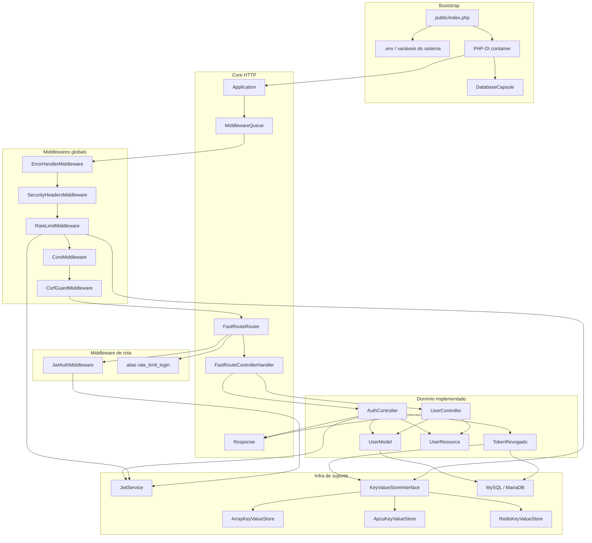
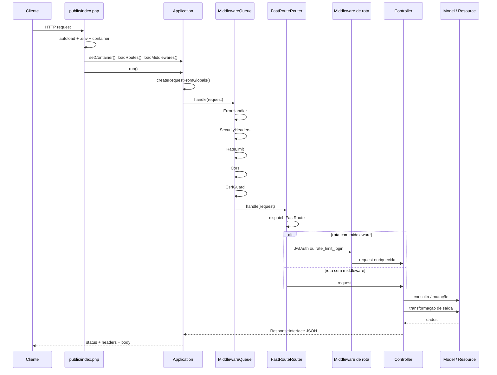
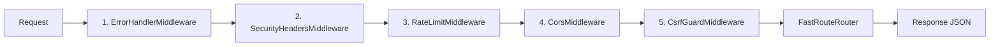
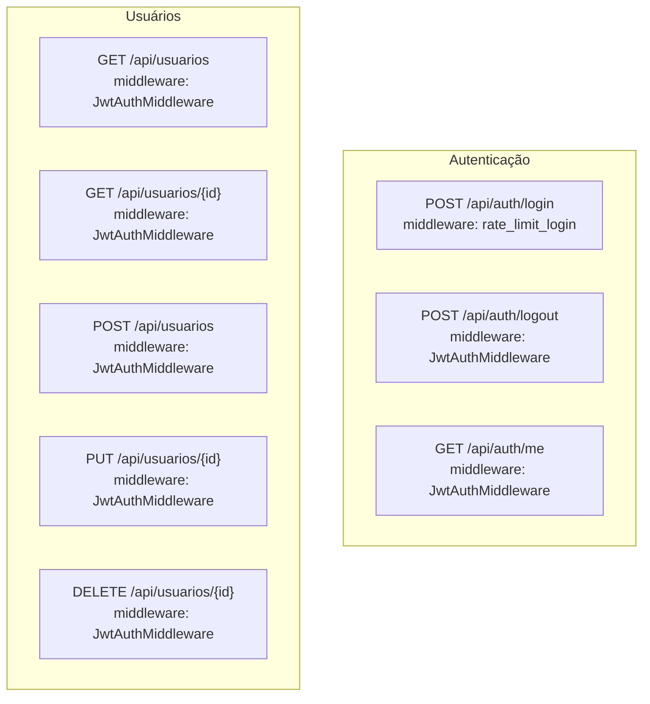
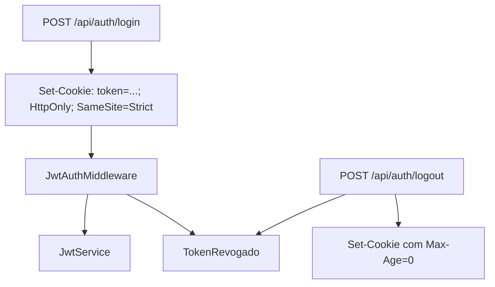
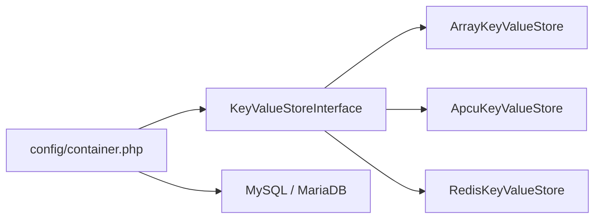

# Diagrama do Parrot PHP

Este documento descreve a arquitetura que o código do repositório implementa hoje.

## Visão Geral

```mermaid
flowchart TB
    subgraph Entrada["Bootstrap"]
        INDEX["public/index.php"]
        ENV[".env / variáveis do sistema"]
        DI["PHP-DI container"]
        DB["DatabaseCapsule"]
    end

    subgraph Core["Core HTTP"]
        APP["Application"]
        FILA["MiddlewareQueue"]
        ROUTER["FastRouteRouter"]
        HANDLER["FastRouteControllerHandler"]
        RESP["Response"]
    end

    subgraph Globais["Middlewares globais"]
        ERR["ErrorHandlerMiddleware"]
        SEC["SecurityHeadersMiddleware"]
        RL["RateLimitMiddleware"]
        CORS["CorsMiddleware"]
        CSRF["CsrfGuardMiddleware"]
    end

    subgraph Rota["Middleware de rota"]
        JWT["JwtAuthMiddleware"]
        LOGINRL["alias rate_limit_login"]
    end

    subgraph Dominio["Domínio implementado"]
        AUTH["AuthController"]
        USERCTRL["UserController"]
        USERMODEL["UserModel"]
        TOKENMODEL["TokenRevogado"]
        USERRES["UserResource"]
    end

    subgraph Infra["Infra de suporte"]
        JWTSVC["JwtService"]
        CACHE["KeyValueStoreInterface"]
        ARRAY["ArrayKeyValueStore"]
        APCU["ApcuKeyValueStore"]
        REDIS["RedisKeyValueStore"]
        MYSQL["MySQL / MariaDB"]
    end

    INDEX --> ENV
    INDEX --> DI
    DI --> DB
    DI --> APP
    APP --> FILA
    FILA --> ERR --> SEC --> RL --> CORS --> CSRF --> ROUTER
    ROUTER --> LOGINRL
    ROUTER --> JWT
    ROUTER --> HANDLER
    HANDLER --> AUTH
    HANDLER --> USERCTRL
    AUTH --> USERMODEL
    AUTH --> USERRES
    AUTH --> JWTSVC
    AUTH --> TOKENMODEL
    USERCTRL --> USERMODEL
    USERCTRL --> USERRES
    USERMODEL --> MYSQL
    TOKENMODEL --> MYSQL
    TOKENMODEL --> CACHE
    RL --> CACHE
    RL --> JWTSVC
    JWT --> JWTSVC
    CACHE --> ARRAY
    CACHE --> APCU
    CACHE --> REDIS
    AUTH --> RESP
    USERCTRL --> RESP
```

## Ciclo da Requisição

```mermaid
sequenceDiagram
    participant Cliente
    participant Index as public/index.php
    participant App as Application
    participant Fila as MiddlewareQueue
    participant Router as FastRouteRouter
    participant MidRota as Middleware de rota
    participant Controller
    participant Model as Model / Resource

    Cliente->>Index: HTTP request
    Index->>Index: autoload + .env + container
    Index->>App: setContainer(), loadRoutes(), loadMiddlewares()
    Index->>App: run()
    App->>App: createRequestFromGlobals()
    App->>Fila: handle(request)
    Fila->>Fila: ErrorHandler
    Fila->>Fila: SecurityHeaders
    Fila->>Fila: RateLimit
    Fila->>Fila: Cors
    Fila->>Fila: CsrfGuard
    Fila->>Router: handle(request)
    Router->>Router: dispatch FastRoute
    alt rota com middleware
        Router->>MidRota: JwtAuth ou rate_limit_login
        MidRota->>Controller: request enriquecida
    else rota sem middleware
        Router->>Controller: request
    end
    Controller->>Model: consulta / mutação
    Controller->>Model: transformação de saída
    Model-->>Controller: dados
    Controller-->>App: ResponseInterface JSON
    App-->>Cliente: status + headers + body
```

## Ordem Real dos Middlewares Globais

```mermaid
flowchart LR
    REQ["Request"]
    ERR["1. ErrorHandlerMiddleware"]
    SEC["2. SecurityHeadersMiddleware"]
    RL["3. RateLimitMiddleware"]
    CORS["4. CorsMiddleware"]
    CSRF["5. CsrfGuardMiddleware"]
    ROUTER["FastRouteRouter"]
    RES["Response JSON"]

    REQ --> ERR --> SEC --> RL --> CORS --> CSRF --> ROUTER --> RES
```

Observações:

- `JwtAuthMiddleware` não é global. Ele entra como middleware de rota.
- `POST /api/auth/login` usa o alias de container `rate_limit_login` como middleware de rota.
- `RateLimitMiddleware` usa `sub` do JWT válido como identificador preferencial e faz fallback para IP.

## Rotas Implementadas

```mermaid
flowchart TB
    subgraph Auth["Autenticação"]
        L["POST /api/auth/login<br/>middleware: rate_limit_login"]
        O["POST /api/auth/logout<br/>middleware: JwtAuthMiddleware"]
        M["GET /api/auth/me<br/>middleware: JwtAuthMiddleware"]
    end

    subgraph Usuarios["Usuários"]
        I["GET /api/usuarios<br/>middleware: JwtAuthMiddleware"]
        S["GET /api/usuarios/{id}<br/>middleware: JwtAuthMiddleware"]
        C["POST /api/usuarios<br/>middleware: JwtAuthMiddleware"]
        U["PUT /api/usuarios/{id}<br/>middleware: JwtAuthMiddleware"]
        D["DELETE /api/usuarios/{id}<br/>middleware: JwtAuthMiddleware"]
    end
```

## Autenticação e Revogação

```mermaid
flowchart TD
    LOGIN["POST /api/auth/login"]
    COOKIE["Set-Cookie: token=...; HttpOnly; SameSite=Strict"]
    JWTMW["JwtAuthMiddleware"]
    JWTSVC["JwtService"]
    BLACKLIST["TokenRevogado"]
    LOGOUT["POST /api/auth/logout"]
    CLEAR["Set-Cookie com Max-Age=0"]

    LOGIN --> COOKIE
    COOKIE --> JWTMW
    JWTMW --> JWTSVC
    JWTMW --> BLACKLIST
    LOGOUT --> BLACKLIST
    LOGOUT --> CLEAR
```

Observações:

- O token é aceito exclusivamente do cookie `token`.
- O logout persiste o `jti` em `tokens_revogados` e também o cacheia.
- `Secure` no cookie é habilitado em HTTPS, em produção ou via `X-Forwarded-Proto=https` quando o proxy é confiável.

## Persistência e Cache

```mermaid
flowchart LR
    CONTAINER["config/container.php"]
    STORE["KeyValueStoreInterface"]
    ARRAY["ArrayKeyValueStore"]
    APCU["ApcuKeyValueStore"]
    REDIS["RedisKeyValueStore"]
    DB["MySQL / MariaDB"]

    CONTAINER --> STORE
    STORE --> ARRAY
    STORE --> APCU
    STORE --> REDIS
    CONTAINER --> DB
```

Regras atuais do container:

- `APP_ENV=testing` força `ArrayKeyValueStore`.
- Em desenvolvimento, `CACHE_STORE=auto` pode cair para Redis, APCu ou array.
- Em produção, o container rejeita `array`, `memory` e `apcu`.
- Em produção, Redis é exigido para rate limit e blacklist distribuídos.
